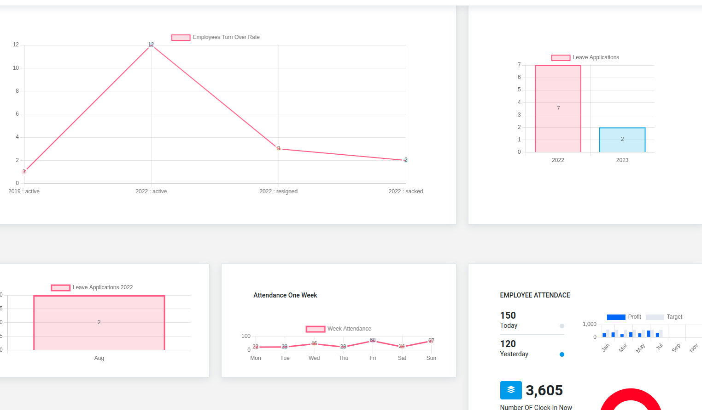
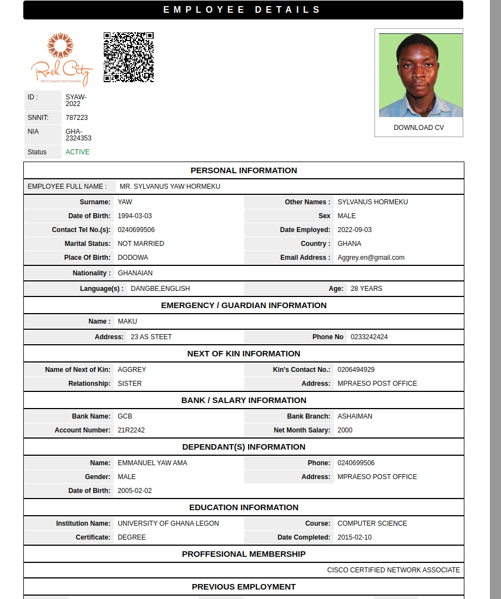

# ROYAL DESK

Built with django, DJango Rest  Framework And Jquary As the Front End

Latest technogies are used to build this project

1. Django And Django RestFramework
2. RabbitMQ As the Message Broker
3. Celery as the channel for communication
4. Celery Beat as the message or task scheduler

The Project consist of Four (4)) Key Models

1. Human Resource Management System (from interview to hiring as an employee)
2. Leave Management System
3. Help Desk Management System
4. Attendance

# HUMAN RESOURCE MODEL

EMPLOYEES DATA PRESENTED IN CONPREHENSIVE GRAPHS (turn over rates by quarter,number of employees, employees marital status,dependants,countrys of origin etc)

Adding A new Applicant

application received by celery to imporve user experience (no delay in sending mail when the use press submit)

Celery Have Delivered the mail without any delay from the sender to the reciver

Applicant Received the mail and can check the status of the Job Application by using the details provided in the mail ie the Unique ID

Applucation Status Under Review By HR Department

Application Status Chaged from In Review to **SELECTED**

Email Alert have been sent again upon selection by celery

Applicant Checking his/her Application Offer again upon receiveing of this email

Appicant Can Download Offer Letter Without visiting the Job Location

(can not show the job application offer letter for security reasons *thanks for understanding*)

HR Department Declining a Job Offer

HR Department transferring applicant from Job Seeker to Eployee

#### PERSONAL INFOMATION

DEPENDANTS INFOMATION

#### FORMAL EDUCATION INFOMATION

### PROFESSIOBAL MEMBERSHIP

### PREVIOUS EMPLOYEMENT

### FINISED ENROLMENT OF NEW APPLICANT AND EMPLOYEE ID GENERATED

EMPLOYEE DETAIL PROFILE FOR THE HR DEPARTMENT

# LEAVE MANAGEMENT

#### LEAVE POLICY SETUP

Employee Applying for leave

employees can apply for leave(holidays) from the comfort of their homes using their generated ID Number

### WELCOMING EMPLOYEE IF EMPLOYEE ID IS VALID

#### DISPLAYING ERROR MESSAGE IF ID IS INVALID

#### APPLYING FOR LEAVE

### upon succesful of leave application, email alert is sent instanly to the head of department for confirmation

ON APPROVAL OF LEAVE BY THE HEAD OF DEPARTMENT, HR WILL ALSO RECIVED A MAIL TO APPROVE THE LEAVE (companies policy)

leave can only be approved by the right authority

LEAVE APPROVED BY HR AND HOD

LEAVE STATUS CHANGED FROM PENDING TO APPROVE

### EMAIL ALERT WILL BE SENT TO THE HR DEPARTMENT AND THE HEAD OF DEPARTMENT ON EMPLOYEES WHO ARE TO REPORT TO WORK THE NEXT DAY WHOM HAVE ONE DAY TO END THEIR LEAVE

EMAILS ATTACHEMNT CONTAINS THE LIST OF EMPLOYEES

HR DEPARTMENT OR HEAD OF DEPRTMENT ACKNOWLEDGING THAT EMPLOYEE IS BACK FROM LEAVE By ticking the **(From Leave)** Button

[Anviz Global | Powering a Smarter World](https://www.anviz.com/)

Anviz time attendance devices data have been integrated with employees data and it detects instantly if an employee  is on leave and have clocked in, the from leave action will be fired authomatically by **django celery beat**

and mark the employee as FROM LEAVE

EMPLOYEES LEAVE HISTORY AVAILABLE FOR HR AND HODS

##### LEAVE DATA PRSENTED IN GRAPHS

HELP DESK

Empoyees can channel means of communication through the helpdesk system to ensure people are accountable when complains are channed to them

Emails are sent to the right people when complains are logged in the helpdesk sustem

ATTENDACE

[Anviz Global | Powering a Smarter World](https://www.anviz.com/)

anviz time attendace device is used to clockin by Employees but what this system does it that it takes the data from anviz database and presents it in a manner recormmened by the Human Resource Department for easy tracking of employees attandace in the company and authomatically sends monthly and quarterly attendace and reporting to The complanies head quartes view email.

# DEPARTMENT AND DESIGNATION SETUP

# MONITORING REAL TIME MESSAGES (tasks) with Flower

